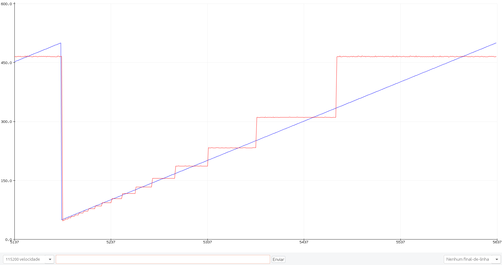
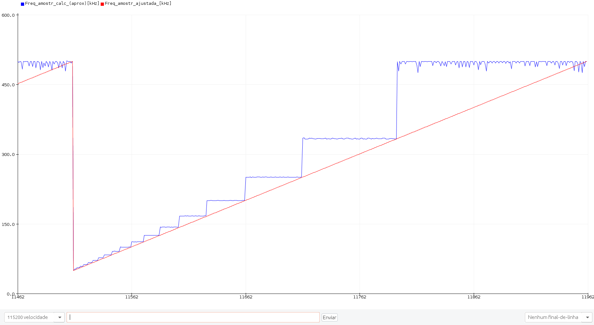

# stm32
Códigos de exemplo de uso do stm32.

## Programas:

### SingleChannelAtSampleRateSimpleDigOut

Programa para verificação da taxa de amostragem da coleta dados analogicos do conversor AD.

O próprio programa cria um PWM via software, coleta esse PWM (necessário ligar os pinos A0 e B0), e calcula a taxa de amostragem.

A taxa de amostragem é controlada por um Timer via hardware, que dispara o conversor AD.

O programa funciona da seguinte forma:

* inicia a coleta no setup();
* ao completar o buffer, pausa o timer e liga a flag_lido;
* transmite os dados coletados por Serial;
* aguarda 1000ms e reicinia o Timer e, com isso, a coleta.
* Enquanto isso, cria um PWM (por software) na porta PB0 de frequencia aproximada sampleFreqkHz/50.
* se ligar a porta A0 na porta B0, deverao aparecer aprox 10 ciclos quadrados no Plotter Serial, independentemente da frequencia usada.

### SingleChannelADCPWMFreq

Programa para verificação da taxa de amostragem da coleta dados analogicos do conversor AD.

O próprio programa cria um PWM via software, coleta esse PWM (necessário ligar os pinos A0 e B0), e calcula a taxa de amostragem.

A frequência desse PWM, neste caso, é aproximada e não é confiável. Assim, a taxa de amostragem calculada também não é confiável.

A taxa de amostragem é controlada por um Timer via hardware, que dispara o conversor AD.

Neste programa, a taxa de amostragem varia automaticamente entre 50 e 500KHz, para que se possa observar o efeito em diferentes ajustes.

O programa funciona da seguinte forma:

* inicia a coleta no setup();
* ao completar o buffer, pausa o timer e liga a flag_lido;
* transmite os dados coletados por Serial;
* aguarda 1000ms e reicinia o Timer e, com isso, a coleta.
* Enquanto isso, cria um PWM (por software) na porta PB0 de frequencia aproximada sampleFreqkHz/50.
* se ligar a porta A0 na porta B0, deverao aparecer aprox 10 ciclos quadrados no Plotter Serial, independentemente da frequencia usada.
* o programa varia automaticamente a frequência de amostragem (de 1 em 1 entre 50 e 500kHz) e a frequência do PWM.

Alternativamente, pode-se ligar flag _flag\_calcula\_frequencia_, que faz com que o programa calcule a frequência amostrada em cada frequência ajustada e mostre os valores, que podem ver vistos no Monitor Serial ou no Ploter Serial.

_Taxa de amostragem calculada (vermelho) e ajustada (azul) ao longo do tempo_

### Arduino_e_STM32

Programa para verificação da taxa de amostragem da coleta dados analogicos do conversor AD.

O PWM (frequência de aproximadamente 10kHz) é gerado via software por um Arduino, enquanto a conversão AD é feita no STM32.

#### ArduinoGeraPWM

Programa para Arduino (testado no Arduino Nano) para geração via software de uma onda PWM com frequência de aproximadamente 10kHz e _duty cycle_ de 50%.

Foi utilizado um osciloscópio para fazer um ajuste fino da frequência do PWM (frequencia medida: 9945Hz).

#### STM32SingleChannelAtSingleSampleRateReadPWM

Este programa mede uma onda PWM de 10kHz externa pela porta A0 e calcula a frequência de amostragem, soltando os valores pela porta serial.

A frequência de amostragem é fixa, podendo ser escolhida no código do programa.

#### STM32SingleChannelAtVariableSampleRateReadPWM

Este programa mede uma onda PWM de 10kHz externa pela porta A0 e calcula a frequência de amostragem, soltando os valores pela porta serial.

A frequência de amostragem é variável entre 50 e 500kHz, variando de 1 em 1kHz.

A taxa de amostragem calculada é tão confiável quanto a frequência do PWM gerada pelo Arduíno.

_Taxa de amostragem calculada (azul) e ajustada (vermelho) ao longo do tempo_

